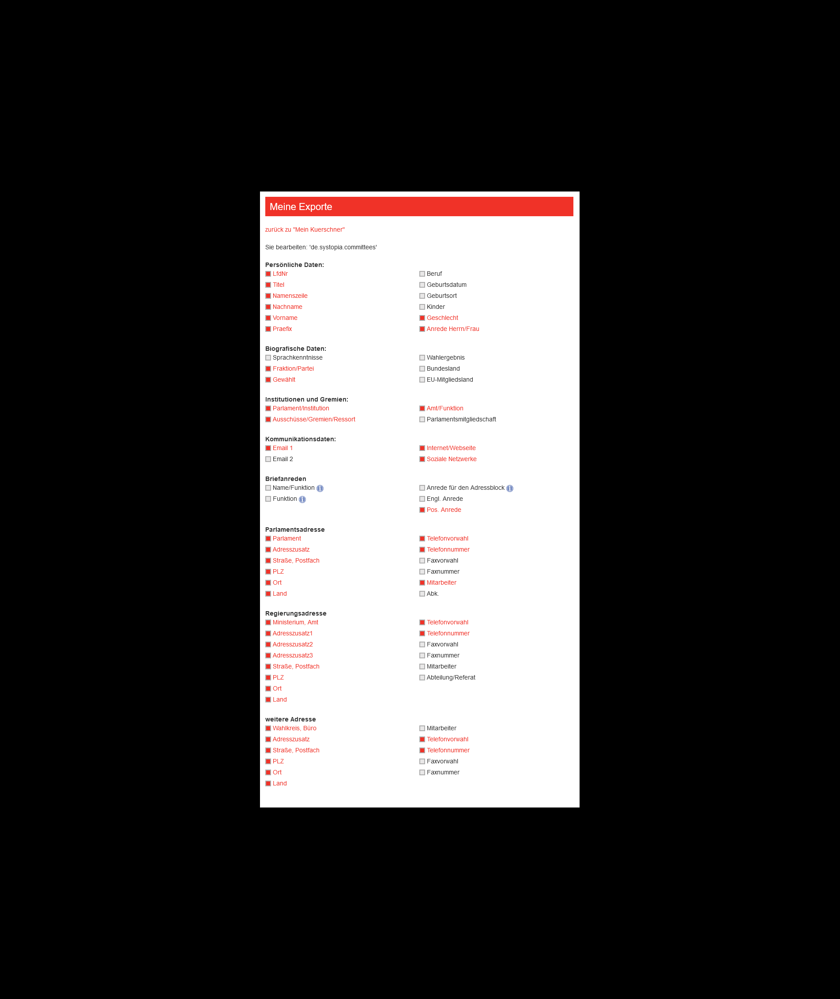

# Kürschner List Importer

Usage is pretty simple. 

You need a CSV file, ISO-8859-1 encoded with a certain set of fields present.
The following screenshot depicts the configuration in Kürschner's export backend. 

Remark: The development of this importer has been funded by Oxfam Germany
