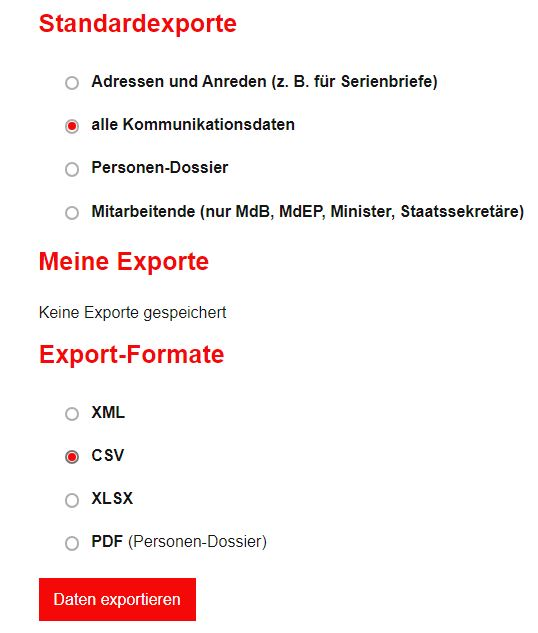
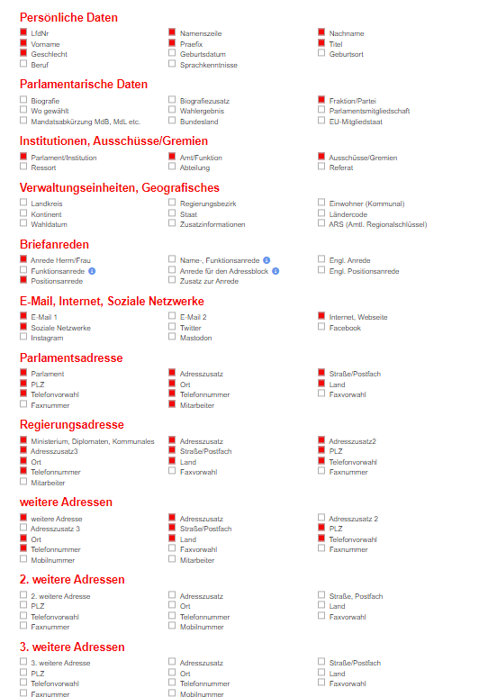

# Kürschner List Importer

Usage is pretty simple.

You need a CSV file, ISO-8859-1 encoded with the following set of headers present (case not relevant):
```
LfdNr;AusgabeGesNamenszeile;Nachname;Vorname;Praefix;Titel;Geschlecht;Fraktion;Parlament;Funktion_Amt;Gremien;AnredeHerrnFrau;PosAnrede;Email1;Internet;Facebook;Twitter;Instagram;AdresseParl;AdresszusatzParl;StrassePostfachParl;PLZParl;OrtParl;EUMitgliedslandParl;TelefonvorwahlParl;TelefonnummerParl;MitarbeiterPARL;MinisteriumAmtReg;RAdresszusatz1;RAdresszusatz2;RAdresszusatz3;StrassePostfachReg;PLZReg;OrtReg;EUMitgliedslandReg;TelefonvorwahlReg;TelefonnummerReg;Wahlkreis;AdresszusatzWK;StrassePostfachWK;PLZWK;OrtWK;EUMitgliedslandWK;TelefonvorwahlWK;TelefonnummerWK
```

The following screenshots depicts the configuration in Kürschner's export backend.




Remark: The initial development of this importer has been funded by Oxfam Germany
